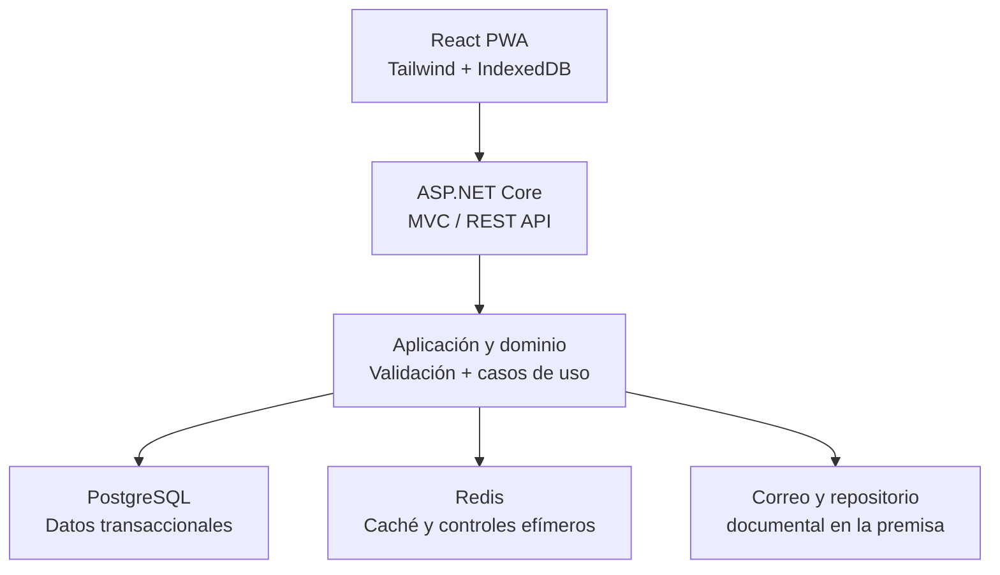
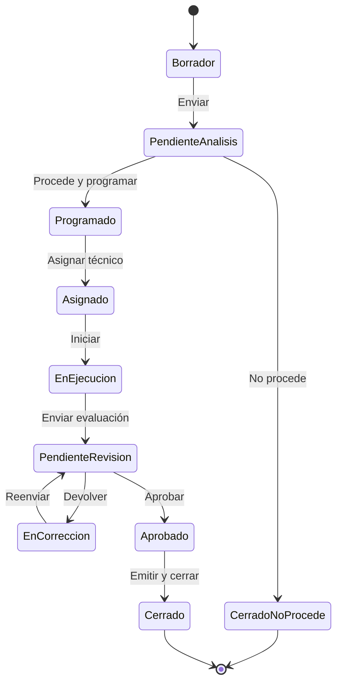
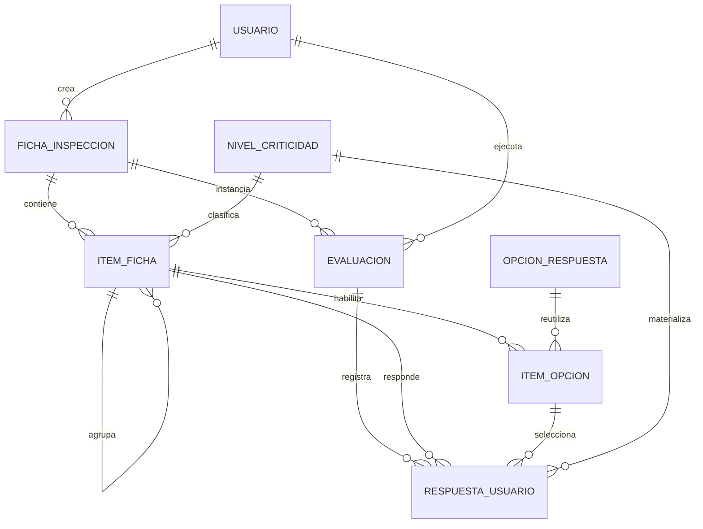

# Especificación de Requisitos de Software (SRS)

## `Sistema PWA para Evaluación Basada en Riesgo (EBR/BPM)`

---

## 1. Introducción

---

## 1.1 Propósito

Definir los requisitos del sistema que gestionará el ciclo integral de Evaluaciones Basadas en Riesgo de establecimientos sujetos a inspección de Buenas Prácticas de Manufactura (BPM): registro, solicitud, apertura de caso, planificación, asignación, ejecución en campo, captura de evidencias, cálculo de riesgo, emisión y revisión del informe, correcciones, cierre, seguimiento e histórico.

El SRS servirá como referencia contractual para análisis, diseño UX/UI, arquitectura, desarrollo, pruebas, aceptación, despliegue, auditoría y mantenimiento.

## 1.2 Alcance del producto

La solución DEBE:

- operar como PWA instalable en escritorio y dispositivos móviles;
- permitir trabajo de campo con conectividad intermitente o inexistente;
- administrar empresas, establecimientos, usuarios, casos y evaluaciones;
- soportar solicitudes de empresa, programación institucional, alertas LAPCH y denuncias;
- permitir que un administrador diseñe y publique fichas sin modificar código;
- representar temas, subtemas, criterios y preguntas mediante `ITEM_FICHA`;
- calcular calificación BPM, no conformidades, riesgo del producto, riesgo del establecimiento, riesgo total y frecuencia de inspección;
- almacenar fotografías, documentos y videos en un repositorio documental en la premisa;
- enviar notificaciones por correo;
- capturar opcionalmente latitud y longitud mediante la API de geolocalización del navegador;
- generar informes, planes de corrección, expedientes históricos y trazabilidad de auditoría.

## 1.3 Objetivos de negocio

| ID | Objetivo |
| --- | --- |
| OB-01 | Estandarizar y digitalizar el proceso EBR/BPM. |
| OB-02 | Reducir errores de transcripción y cálculos manuales. |
| OB-03 | Priorizar inspecciones según riesgo sanitario verificable. |
| OB-04 | Garantizar trazabilidad desde el origen del caso hasta su cierre. |
| OB-05 | Permitir evolución de las fichas sin despliegues de software. |
| OB-06 | Asegurar continuidad operativa en campo mediante trabajo offline y sincronización controlada. |
| OB-07 | Facilitar supervisión, revisión y auditoría con datos e indicadores oportunos. |

## 1.4 Audiencia

- Dueño del proceso EBR/BPM.
- Administradores funcionales y técnicos.
- Analistas de requerimientos y procesos.
- Diseñadores UI/UX.
- Arquitectos y desarrolladores frontend/backend.
- Administradores de base de datos e infraestructura.
- Equipo de ciberseguridad, QA, auditoría y soporte.
- Coordinadores y técnicos evaluadores.

## 1.5 Definiciones y acrónimos

| Término | Definición |
| --- | --- |
| BPM | Buenas Prácticas de Manufactura. |
| EBR | Evaluación Basada en Riesgo. |
| PWA | Aplicación web progresiva instalable y con capacidades offline. |
| DPS/DAS | Dirección Provincial de Salud / Dirección de Área de Salud. |
| HACCP | Sistema de Análisis de Peligros y Puntos Críticos de Control. |
| INABIE | Instituto Nacional de Bienestar Estudiantil. |
| LAPCH | Identificador del proceso de alertas citado por SRC-04; su definición institucional exacta queda pendiente de validación. |
| NC | No conformidad. |
| NC Crítica | Incumplimiento que afecta directamente la inocuidad y exige medida inmediata, según la guía de SRC-01. |
| NC Mayor | Incumplimiento con afectación potencial a la inocuidad y corrección a corto plazo, según SRC-01. |
| NC Menor | Incumplimiento que no pone en riesgo directo la inocuidad, según SRC-01. |
| Ficha | Plantilla versionada que define la estructura y reglas de una evaluación. |
| Ítem | Nodo genérico de la ficha: sección, subsección, criterio, pregunta o agrupador evaluable. |
| Caso | Expediente operativo originado por solicitud, programación, alerta o denuncia. |
| Evaluación | Instancia ejecutada con una versión inmutable de una ficha. |
| Sincronización | Envío y reconciliación de operaciones creadas offline con el servidor. |

---

# 2. Descripción general

## 2.1 Perspectiva del producto

El sistema será una solución web desacoplada. React implementará la PWA y consumirá exclusivamente la API REST del backend. ASP.NET Core expondrá controladores MVC/API y orquestará dominio, persistencia, caché e integraciones. PostgreSQL será la fuente transaccional; Redis acelerará lecturas y apoyará controles efímeros; el repositorio documental en la premisa almacenará los binarios.

## 2.2 Actores y responsabilidades

| Rol | Responsabilidades principales |
| --- | --- |
| Administrador | Gestionar usuarios, roles, catálogos, parámetros, empresas, establecimientos, fichas dinámicas, versiones, niveles de criticidad, reglas de riesgo, notificaciones y auditoría. |
| Administrador de Empresa | Gestionar datos autorizados de su empresa/establecimientos, delegados, solicitudes, documentos, notificaciones, correcciones e informes. |
| Usuario Delegado | Actuar en representación de una empresa dentro del alcance otorgado; crear y consultar solicitudes, aportar documentos y responder correcciones autorizadas. |
| Coordinador | Evaluar procedencia, priorizar casos, programar, asignar o reasignar técnicos, revisar evaluaciones, aprobar, devolver, solicitar correcciones y cerrar expedientes cuando corresponda. |
| Técnico Evaluador | Consultar agenda, descargar trabajo, ejecutar fichas, registrar respuestas, hallazgos, criticidad, evidencias y geolocalización, emitir borrador y remitir evaluación. |
| Servicio del sistema | Ejecutar cálculo, generación de informes, sincronización, auditoría, expiración de OTP, notificaciones y tareas programadas. |

## 2.3 Matriz resumida de permisos

| Capacidad | Admin. | Admin. empresa | Delegado | Coordinador | Técnico |
| --- | --- | --- | --- | --- | --- |
| Configurar ficha y publicarla | ✓ | — | — | Consulta | Consulta |
| Gestionar catálogos y reglas | ✓ | — | — | Consulta | Consulta |
| Gestionar usuarios internos | ✓ | — | — | — | — |
| Gestionar delegados de empresa | Supervisar | ✓ | — | — | — |
| Registrar/editar empresa | ✓ | ✓ limitada | — | Consulta | Consulta asignada |
| Crear solicitud BPM | ✓ | ✓ | ✓ autorizada | — | — |
| Registrar alerta o denuncia | ✓ | — | — | ✓ | — |
| Programar/asignar | ✓ | — | — | ✓ | — |
| Ejecutar evaluación | — | — | — | Consulta | ✓ asignada |
| Revisar/aprobar/devolver | Supervisar | — | — | ✓ | — |
| Responder correcciones de empresa | — | ✓ | ✓ autorizada | Consulta | Consulta |
| Cerrar expediente | ✓ | — | — | ✓ | — |
| Ver histórico | Global | Propio | Autorizado | Global operativo | Asignado/histórico permitido |
| Ver auditoría | ✓ | — | — | Resumen autorizado | — |

> La autorización DEBE aplicar simultáneamente RBAC y alcance por recurso. Poseer un rol no autoriza a consultar empresas, casos o evaluaciones ajenos a su ámbito.
> 

## 2.4 Supuestos y dependencias

- Los catálogos iniciales serán depurados y aprobados antes de producción.
- El repositorio documental en la premisa ofrecerá carpeta compartida segura o API HTTP documentada; el adaptador será intercambiable.
- El sistema de correo estará disponible mediante SMTP o API HTTP institucional.
- El dispositivo del técnico contará con cámara y almacenamiento suficiente cuando se requieran evidencias.
- La geolocalización depende del consentimiento del usuario, permisos del navegador y capacidades del dispositivo.
- La autoridad funcional aprobará umbrales, pesos y reglas antes de publicar cada versión.

## 2.5 Restricciones

- Frontend obligatorio: React con TypeScript, PWA pura y Tailwind CSS.
- Backend obligatorio: .NET/ASP.NET Core MVC con API REST.
- Persistencia obligatoria: PostgreSQL mediante Dapper; no se usará Entity Framework como ORM transaccional.
- Componentes obligatorios: Serilog, Redis, FluentValidation, Dapper y Refit.
- Las únicas integraciones externas autorizadas son correo, repositorio documental en la premisa y geolocalización del navegador.
- No se integrarán SMS, firma electrónica, mapas, geocodificación, redes sociales ni sistemas de terceros no autorizados.
- Una evaluación histórica DEBE conservar la versión exacta de ficha, opciones, reglas y parámetros con que fue ejecutada.

## 2.6 Fuera de alcance

- Cobro o pasarela de pago.
- Firma electrónica certificada.
- Envío de SMS o mensajería instantánea.
- Geocodificación inversa, mapas de terceros o seguimiento permanente del dispositivo.
- Analítica predictiva o inteligencia artificial para modificar dictámenes.
- Edición directa de archivos binarios dentro del repositorio documental.
- Sustitución de decisiones sanitarias que requieran criterio de la autoridad competente.

---

# 3. Procesos y estados

## 3.1 Orígenes de un caso

| Código | Origen | Actor iniciador | Resultado |
| --- | --- | --- | --- |
| SOLICITUD_EMPRESA | Solicitud BPM de empresa | Admin. empresa o delegado | Caso pendiente de análisis/asignación. |
| PROGRAMACION | Programación institucional | Coordinador/Administrador | Caso planificado por frecuencia, control o campaña. |
| ALERTA_LAPCH | Alerta LAPCH | Coordinador/Administrador | Evaluación si procede; cierre motivado si no procede. |
| DENUNCIA | Denuncia o reporte | Coordinador/Administrador | Evaluación, remisión o cierre motivado. |

## 3.2 Flujo principal

## 3.3 Estados del caso

| Estado | Descripción | Acciones permitidas relevantes |
| --- | --- | --- |
| BORRADOR | Registro aún no remitido. | Editar, adjuntar, eliminar borrador, enviar. |
| PENDIENTE_ANALISIS | Espera decisión de procedencia/prioridad. | Revisar, solicitar información, declarar procedencia/no procedencia. |
| PENDIENTE_PROGRAMACION | Procede, aún sin fecha. | Programar. |
| PROGRAMADO | Posee fecha y ventana de atención. | Reprogramar, cancelar justificadamente, asignar. |
| ASIGNADO | Tiene técnico responsable. | Reasignar justificadamente, descargar trabajo, iniciar. |
| EN_EJECUCION | Evaluación iniciada. | Responder, guardar, adjuntar, pausar, finalizar. |
| PENDIENTE_REVISION | Evaluación enviada y bloqueada para el técnico. | Revisar, aprobar, devolver. |
| EN_CORRECCION | Existe una solicitud de corrección. | Corregir únicamente campos habilitados, reenviar. |
| APROBADO | Revisión superada. | Generar/emitir informe, iniciar seguimiento si aplica. |
| CERRADO | Expediente final e inmutable. | Consultar, descargar, auditar. |
| CERRADO_NO_PROCEDE | Origen analizado sin evaluación. | Consultar decisión y evidencia. |
| CANCELADO | Atención cancelada con causa. | Consultar o crear nueva programación según permiso. |

## 3.4 Estados de una ficha

| Estado | Regla |
| --- | --- |
| BORRADOR | Editable solo por usuarios autorizados; no seleccionable para nuevas evaluaciones. |
| EN_REVISION | Bloqueada para edición estructural ordinaria; admite aprobación o devolución. |
| PUBLICADA | Inmutable y disponible según vigencia, tipo de caso y establecimiento. |
| RETIRADA | No disponible para nuevas evaluaciones; conserva el histórico. |
| ARCHIVADA | Solo consulta administrativa; nunca implica eliminación física de evaluaciones. |

---

# 4. Requisitos funcionales

## RF-01. Autenticación, sesión y recuperación de contraseña con OTP

**Actores:** todos los usuarios.

**Requisitos:**

1. El sistema DEBE permitir inicio y cierre de sesión con correo/usuario y contraseña.
2. El formulario DEBE mostrar estados inicial, validando, error, cuenta bloqueada, sesión expirada y éxito; el botón de envío permanecerá deshabilitado durante la solicitud para impedir duplicados.
3. La recuperación DEBE usar un OTP numérico de seis dígitos enviado exclusivamente por correo, con vigencia inicial configurable de **15 minutos**.
4. El OTP DEBE ser de un solo uso, almacenarse como hash, invalidarse al emitir uno nuevo y limitarse por usuario, IP y ventana temporal.
5. La pantalla OTP DEBE incluir seis posiciones accesibles, pegado completo, reenvío con cuenta regresiva, correo parcialmente enmascarado y mensajes que no revelen si una cuenta existe.
6. Después de cinco intentos fallidos configurables, el reto DEBE bloquearse y exigir uno nuevo.
7. La nueva contraseña DEBE cumplir la política vigente, confirmarse dos veces y revocar sesiones/refresh tokens anteriores.
8. El backend DEBE registrar intentos, bloqueos, recuperación, cambio y cierre sin almacenar contraseñas, OTP ni tokens en logs.
9. El sistema PUEDE habilitar segundo factor por correo por usuario o rol, sin introducir SMS ni otra integración.

**Criterios de aceptación:** OTP inválido/expirado no cambia la contraseña; OTP válido solo funciona una vez; la respuesta de recuperación es indistinguible para cuentas existentes y no existentes; cerrar sesión elimina datos sensibles locales.

## RF-02. Registro y gestión de usuarios

**Actores:** Administrador, Administrador de Empresa.

1. El Administrador DEBE crear, consultar, editar, activar, suspender y desactivar usuarios internos.
2. El Administrador de Empresa DEBE registrar delegados únicamente para empresas que administra.
3. Se capturarán nombre completo, tipo y número de identificación, correo, teléfono, rol, empresa/ámbito, estado y carta de autorización cuando aplique.
4. Estados mínimos: `PENDIENTE_VALIDACION`, `ACTIVO`, `RECHAZADO`, `SUSPENDIDO`, `DESACTIVADO`, `BLOQUEADO`.
5. Correo e identificación normalizada DEBEN ser únicos conforme al alcance definido por negocio.
6. La carta de autorización DEBE validarse como evidencia documental, con vista previa, progreso, reintento y eliminación antes de enviar.
7. Aprobar, rechazar, suspender o cambiar roles DEBE exigir permiso, motivo y auditoría; el rechazo DEBE poder notificarse por correo.
8. No se permitirá autoasignación de privilegios ni modificar el propio rol privilegiado.

## RF-03. Gestión de empresas y establecimientos

**Actores:** Administrador, Administrador de Empresa.

1. El sistema DEBE registrar empresa y uno o más establecimientos.
2. Datos de empresa: razón social, RNC, nombre comercial, actividad económica, teléfono, correo, estado y representantes legal, de calidad y contacto principal.
3. Datos del establecimiento: nombre, calle, número, municipio, provincia, DPS/DAS, teléfono, correo, fecha de inicio, permiso sanitario, vencimiento, productos, producción anual, empleados por sexo, comercialización, mercado objetivo, categoría/subcategoría alimentaria y datos HACCP/muestreo/INABIE.
4. El RNC DEBE normalizarse, validarse y evitar duplicidad.
5. Al crear o editar un establecimiento, el frontend DEBE ofrecer **“Usar mi ubicación actual”**. Tras consentimiento, capturará latitud, longitud, precisión y fecha/hora desde la API del navegador.
6. La ubicación será opcional. Si el usuario deniega permiso, no hay señal o el navegador no soporta la capacidad, podrá continuar y verá una explicación no bloqueante.
7. El backend DEBE validar latitud entre -90 y 90, longitud entre -180 y 180 y conservar precisión/origen. No se realizará geocodificación externa.
8. El histórico de cambios críticos de empresa/establecimiento DEBE conservar valor anterior, nuevo, usuario, fecha y motivo.

## RF-04. Dashboards por rol

1. **Empresa:** nueva solicitud, borradores, solicitudes por estado, evaluaciones, correcciones, informes y notificaciones.
2. **Coordinador:** casos pendientes, alertas, denuncias, programación, asignaciones, carga por técnico, revisiones, vencimientos y distribución de riesgo.
3. **Técnico:** evaluaciones asignadas, agenda día/semana/mes, trabajo descargado, borradores offline, sincronización pendiente e informes devueltos.
4. **Administrador:** usuarios, empresas, fichas por estado, catálogos, fallos de sincronización, uso documental, auditoría e indicadores globales.
5. Cada indicador DEBE indicar período, filtros activos, última actualización y enlace al detalle.
6. El backend DEBE aplicar filtros de ámbito y usar Redis para agregados de lectura con invalidación por eventos de negocio.
7. Estados del frontend: esqueleto de carga, vacío con acción sugerida, datos, error reintentable y offline con último dato disponible y sello temporal.

## RF-05. Solicitudes BPM

1. El usuario autorizado DEBE crear, editar y eliminar borradores de solicitud.
2. Campos mínimos: empresa, establecimiento, motivo, tipo de establecimiento, observaciones y documentación requerida.
3. Acciones: guardar borrador, validar, enviar y cancelar antes del envío.
4. La documentación obligatoria DEBE depender del motivo y de reglas administrativas versionadas.
5. Al enviar, el backend DEBE asignar número único, registrar fecha, bloquear campos definidos, crear el caso y dejarlo `PENDIENTE_ANALISIS` o `PENDIENTE_ASIGNACION` según configuración aprobada.
6. Envíos repetidos con la misma clave de idempotencia NO DEBEN crear duplicados.
7. El solicitante recibirá confirmación en la aplicación y, si la plantilla está activa, por correo.

## RF-06. Gestión unificada de casos

1. Todo caso DEBE tener origen, prioridad, empresa/establecimiento, responsable actual, estado, hitos, documentos y línea de tiempo.
2. Se admitirán los cuatro orígenes definidos en 3.1.
3. El coordinador DEBE declarar `PROCEDE`, `NO_PROCEDE` o `REQUIERE_INFORMACION`, con motivo obligatorio.
4. La vista de caso DEBE presentar encabezado fijo, datos clave, pestañas Resumen, Programación, Evaluaciones, Evidencias, Correcciones, Comunicaciones y Auditoría autorizada.
5. Cada transición DEBE validarse en el backend; ocultar un botón en frontend no reemplaza la autorización.

## RF-07. Programación y reprogramación de evaluaciones

1. El Coordinador DEBE programar fecha/hora, duración estimada, prioridad, motivo, establecimiento, ficha sugerida y observaciones.
2. El sistema DEBE advertir conflictos del técnico, cierres/cancelaciones, feriados cargados como catálogo y solapamientos configurables.
3. Reprogramar o cancelar DEBE exigir motivo, conservar historial y notificar a las partes.
4. La frecuencia derivada por el motor de riesgo DEBE proponer la próxima ventana sin impedir una programación extraordinaria justificada.
5. Las fechas se almacenarán en UTC y se presentarán en la zona horaria configurada.

## RF-08. Gestión de alertas LAPCH

1. Se registrarán número de alerta, fecha, producto, empresa/establecimiento, descripción, prioridad, fuente interna y documentos.
2. El análisis permitirá `PROCEDE_EVALUACION`, `NO_PROCEDE` o `REQUIERE_INFORMACION`.
3. Si procede, se creará un caso vinculado sin duplicar los datos de la alerta.
4. Cerrar sin evaluación DEBE exigir decisión motivada y usuario responsable.
5. LAPCH será un módulo interno; no se conectará a un sistema externo mientras no exista autorización de alcance.

## RF-09. Gestión de denuncias y reportes

1. Se capturarán tipo, fecha de recepción, canal, denunciante cuando corresponda, anonimato, descripción, productos/establecimiento, evidencias y confidencialidad.
2. Resultado: `PROCEDE`, `NO_PROCEDE`, `REMITIDA_OTRO_PROCESO` o `REQUIERE_INFORMACION`.
3. Los datos del denunciante DEBEN restringirse por permiso y no mostrarse en informes destinados a la empresa salvo autorización normativa.
4. El sistema DEBE advertir posibles duplicados por establecimiento, producto y rango de fechas, sin bloquear injustificadamente.

## RF-10. Asignación y reasignación del evaluador

1. El Coordinador DEBE asignar uno o más técnicos y designar un responsable principal si el proceso lo permite.
2. La selección mostrará disponibilidad, carga, zona/ámbito y conflictos; estos criterios son informativos salvo regla institucional.
3. Reasignar DEBE exigir motivo, conservar responsables anteriores, revocar acceso no requerido y notificar a involucrados.
4. No se asignará un usuario inactivo, suspendido o fuera del ámbito autorizado.

## RF-11. Calendario del evaluador

1. Vistas obligatorias: día, semana, mes y lista.
2. Cada evento mostrará empresa, establecimiento, dirección, fecha/hora, estado, prioridad y disponibilidad offline.
3. Permitirá filtrar por estado y abrir el detalle; solo roles autorizados podrán reprogramar mediante acción explícita.
4. Debe ser navegable por teclado, adaptable a móvil y legible sin depender únicamente del color.
5. En modo offline se mostrará la última agenda sincronizada y no se asumirán cambios no confirmados por el servidor.

## RF-12. Ejecución de la evaluación

1. El técnico DEBE descargar previamente la evaluación y su ficha publicada, catálogos y metadatos requeridos.
2. Acciones: iniciar, pausar, continuar, guardar, validar, finalizar y enviar a revisión.
3. Al iniciar se registrarán usuario, dispositivo lógico, fecha/hora servidor y, si existe permiso, ubicación inicial.
4. La navegación DEBE mostrar avance global y por sección, pendientes, errores, no conformidades y evidencias faltantes.
5. Guardado local será inmediato; el guardado servidor se ejecutará en línea o al sincronizar.
6. Finalizar ejecutará validación completa. Enviar bloqueará respuestas salvo devolución formal.
7. La evaluación nunca cambiará de versión de ficha después de iniciada.
8. Si una ficha fue retirada después de descargarla, el servidor aplicará la política configurada: permitir completar la instancia ya creada o bloquear con instrucción explícita; la decisión quedará auditada.

## RF-13. Formulario dinámico de Evaluación Basada en Riesgo

### RF-13.1 Construcción y representación

1. El frontend DEBE construir el formulario desde la definición publicada recibida por API, sin componentes codificados para temas específicos.
2. `es_evaluable = false`: el ítem organiza, agrupa, muestra título, instrucción o subtotal; no admite respuesta.
3. `es_evaluable = true`: el ítem admite respuesta aunque represente un criterio final o una subsección evaluada como unidad.
4. Cada ítem tendrá código, título, descripción/ayuda, tipo, padre, nivel, orden, obligatoriedad, opciones, criticidad, reglas condicionales, evidencia requerida y fórmula/peso autorizado.
5. La PWA renderizará secciones plegables, índice, barra de avance, búsqueda por código/texto, filtros de pendientes/NC y navegación anterior/siguiente.

### RF-13.2 Opciones de cumplimiento BPM

Según **“Ficha Inspección BPM Revisión Final 23-09-24 revisado FSP-FD octubre 2024_”**, la configuración inicial incluirá:

| Código | Significado | Puntaje base | Efecto |
| --- | --- | --- | --- |
| C | Cumple / cumplimiento total | 1.00 | Suma al numerador y denominador. |
| CP | Cumplimiento parcial | 0.50 | Suma 0.50 al numerador y 1 al denominador. |
| IT | Incumplimiento total | 0.00 | Suma 0 al numerador y 1 al denominador; puede generar NC. |
| N/A | No aplica | No puntúa | Se excluye del denominador y exige justificación si así se configura. |

Las opciones, puntajes y efectos DEBEN almacenarse en `OPCION_RESPUESTA` e `ITEM_OPCION`; no se codificarán en React ni en condiciones de SQL.

### RF-13.3 Dropdowns obligatorios de la ficha

Los siguientes campos DEBEN implementarse como menús desplegables; no se aceptará texto libre como sustituto del valor canónico:

| Campo | Fuente y comportamiento |
| --- | --- |
| DPS/DAS | Obligatorio. Catálogo inicial de SRC-01. Búsqueda incremental y selección única. |
| Comercialización | Obligatorio. Valores iniciales normalizados: Local, Nacional, Internacional, Todos los mercados, conforme a SRC-01. |
| Mercado objetivo | Obligatorio. Valores iniciales: Infantil, niños, adultos, mujeres embarazadas, adultos mayores y todos los segmentos, conforme a SRC-01. |
| Categoría de Alimento | Obligatorio y multiselección cuando el establecimiento elabore varias categorías. SRC-01/SRC-03. |
| Subcategoría | Obligatorio por cada categoría; aparecerá visualmente **al lado de Categoría** en escritorio y debajo, manteniendo asociación inequívoca, en móvil. Lista dependiente filtrada por categoría. SRC-01/SRC-03. |
| Motivo de inspección | Obligatorio. Valores iniciales de SRC-01: Solicitud de Permiso Sanitario, Renovación, Solicitud de Certificación BPM, Inspección programada, Inspección de control, Investigación por denuncia y Otro. “Otro” exige detalle. |
| ¿Tienen implementado el sistema HACCP? | Dropdown Sí/No obligatorio. SRC-01. |
| Nivel de implementación | Control dropdown obligatorio en la estructura. Se habilita y exige si HACCP = Sí: 25 %, 75 % o todas las líneas; si HACCP = No queda deshabilitado y sin valor. SRC-01/SRC-02. |
| ¿Tienen un plan de muestreo microbiológico? | Dropdown Sí/No obligatorio. SRC-01. |
| ¿Dónde lo aplican? | Control dropdown obligatorio en la estructura. Se habilita y exige si el plan = Sí: materias primas; áreas de proceso y productos terminados; o ambos. SRC-01/SRC-02. |
| ¿Son suplidores del INABIE? | Dropdown Sí/No obligatorio. SRC-01. |
| ¿Cómo lo distribuyen? | Control dropdown obligatorio en la estructura. Se habilita y exige si INABIE = Sí: local, regional o nacional. SRC-01/SRC-02. |
| Categoría de riesgo | Dropdown obligatorio Bajo/Medio/Alto basado en **“Hoja de Cálculo Categorización Establecimiento y Frecuencia de Inspección revisado SBR”**. Se autoseleccionará desde SRC-03 cuando exista correspondencia; una excepción manual requiere permiso y justificación. |

### RF-13.4 Validaciones y estados visuales

1. Cada control mostrará etiqueta persistente, indicador obligatorio, ayuda, valor, error junto al campo y resumen de errores al validar.
2. Estados: no respondido, respondido, inválido, no aplica, con NC, con evidencia pendiente, guardando, guardado local, sincronizado y conflicto.
3. Las dependencias se evaluarán tanto en frontend como backend. Los valores de campos deshabilitados DEBEN limpiarse o marcarse no aplicables de forma consistente.
4. Seleccionar una respuesta configurada como incumplimiento podrá exigir observación, criticidad, evidencia y medida correctiva.
5. No se permitirá enviar si falta una respuesta obligatoria visible o una evidencia requerida.
6. Cambiar una respuesta que invalida una evidencia/NC asociada requerirá confirmación y conservará trazabilidad de la corrección.

## RF-14. Motor de calificación y riesgo

### RF-14.1 Calificación BPM

La configuración inicial de SRC-01 usa 45 puntos posibles y la escala C=1, CP=0.5, IT=0, N/A excluido. El cálculo normativo será:

[
 =  
]

| Porcentaje | Condición inicial | Orientación inicial de SRC-01 |
| --- | --- | --- |
| ≤ 60 % | Inaceptable | Considerar cierre. |
| > 60 % y ≤ 70 % | Deficiente | Urge corregir. |
| > 70 % y ≤ 80 % | Regular | Necesario corregir. |
| > 80 % | Buena | Algunas correcciones; el dictamen depende del motivo y de las NC. |

### RF-14.2 Riesgo del producto

De acuerdo con SRC-02 y SRC-03:

- Riesgo bajo = 1.
- Riesgo medio = 2.
- Riesgo alto = 3.
- Si existen varias subcategorías, `RP` será el **mayor** nivel de riesgo válido entre ellas.
- Una subcategoría sin clasificación NO permitirá calcular el resultado final; deberá corregirse el catálogo o registrarse una excepción autorizada y auditada.

### RF-14.3 Riesgo del establecimiento

La configuración inicial de **“Hoja de Cálculo Categorización Establecimiento y Frecuencia de Inspección revisado SBR”** será:

| Factor | Peso |
| --- | --- |
| Volumen de producción | 16 % |
| Implementación HACCP | 9 % |
| Cumplimiento BPM | 56 % |
| Proveedor INABIE | 5 % |
| Rechazos de registros sanitarios por incumplimiento microbiológico en los últimos cinco años | 6 % |
| Plan de muestreo microbiológico/análisis de laboratorio | 8 % |
| **Total** | **100 %** |

Cada factor asignará un puntaje parametrizado de 1.00, 1.67, 2.33 o 3.00. El riesgo del establecimiento (`RE`) será la suma de `puntaje_factor × peso_factor`. Los pesos activos DEBEN sumar 100 % antes de publicar una versión de reglas.

### RF-14.4 Riesgo total y frecuencia

[
 =  
]

| Riesgo total | Nivel | Frecuencia inicial |
| --- | --- | --- |
| 1.0 a 3.6, inclusive | Bajo | Anual |
| > 3.6 a 6.3, inclusive | Medio | Semestral |
| > 6.3 | Alto | Trimestral |
1. El motor DEBE devolver entradas, versión de reglas, cálculos intermedios, resultado y fecha.
2. Todo cálculo DEBE poder reproducirse históricamente.
3. El resultado mostrado en UI DEBE incluir explicación “cómo se calculó”, sin permitir editar el valor derivado salvo excepción autorizada.
4. Umbrales, factores, pesos, opciones y frecuencia serán versionados y publicados; nunca se sustituirán retroactivamente.
5. Un resultado incompleto o inválido se mostrará como `NO_CALCULABLE`, no como cero.

## RF-15. Captura y gestión de evidencias

1. Se admitirán fotografías, documentos y videos cortos conforme a tipos y límites configurados.
2. El control DEBE permitir cámara, selector de archivos y arrastrar/soltar en escritorio.
3. Cada archivo mostrará miniatura/icono, nombre, tamaño, progreso, estado de carga, reintento y eliminación antes del envío.
4. Metadatos: evaluación, ítem/respuesta/NC, autor, fecha dispositivo, fecha servidor, tipo MIME detectado, tamaño, hash, ubicación opcional y estado de sincronización.
5. El backend NO confiará en extensión; validará firma/MIME, tamaño, autorización y nombre seguro, y aplicará análisis antimalware institucional si está disponible dentro de la premisa.
6. Los binarios se guardarán en el repositorio documental; PostgreSQL almacenará metadatos y referencia opaca, nunca rutas físicas expuestas al cliente.
7. Offline: la evidencia quedará cifrada o protegida en almacenamiento local según capacidades del navegador, marcada pendiente y subida al recuperar conexión.
8. Eliminar después de enviar será una operación lógica y auditada, sujeta a permiso y retención.

## RF-16. Informe de evaluación

1. El sistema DEBE generar un informe versionado con portada, datos del caso/establecimiento, alcance, ficha utilizada, resumen ejecutivo, calificación, riesgo, frecuencia, respuestas, hallazgos, NC, evidencias autorizadas, medidas correctivas, recomendaciones, responsables y fechas.
2. Se ofrecerá vista HTML accesible y descarga PDF oficial.
3. El borrador llevará marca visible; el informe emitido tendrá número, versión, fecha, emisor y hash de integridad.
4. Regenerar un informe no alterará versiones emitidas; producirá una nueva versión vinculada.
5. La generación DEBE realizarse en servidor con datos persistidos, no solo con el estado del navegador.

## RF-17. Revisión del Coordinador

1. El Coordinador podrá aprobar, devolver o solicitar corrección.
2. La revisión mostrará comparación de calificación, riesgo, NC, evidencias faltantes, campos editados y alertas de consistencia.
3. Aprobar requiere validación completa y comentario opcional; devolver/solicitar corrección requiere comentario y selección de campos o secciones habilitadas.
4. Después del envío, la evaluación queda bloqueada para el técnico hasta una devolución formal.
5. Toda decisión se registrará con usuario, fecha, motivo y versión revisada.

## RF-18. Gestión de correcciones y medidas correctivas

1. El técnico o empresa, según responsable definido, DEBE ver observaciones, fecha límite, estado y evidencia solicitada.
2. Solo campos autorizados podrán editarse; el resto permanecerá visible y bloqueado.
3. Cada corrección conservará valor anterior, nuevo, comentario y evidencia.
4. Estados mínimos: `PENDIENTE`, `EN_PROCESO`, `ENVIADA`, `ACEPTADA`, `RECHAZADA`, `VENCIDA`.
5. Reenviar crea una nueva revisión y devuelve el expediente a `PENDIENTE_REVISION`.
6. Las medidas correctivas incluirán detalle, responsable, fecha compromiso, estado y verificación.

## RF-19. Emisión y cierre del expediente

1. Cerrar requiere decisión final, informe emitido, fecha, responsable y resolución de bloqueos configurados.
2. El sistema calculará y propondrá la próxima inspección según frecuencia.
3. Una NC crítica abierta, evidencia obligatoria faltante o corrección requerida impedirá cierre, salvo excepción con permiso reforzado y motivo.
4. El expediente cerrado será inmutable; cualquier rectificación se gestionará como versión/adenda o nuevo caso relacionado.
5. Acciones: emitir, descargar PDF, consultar integridad y cerrar.

## RF-20. Consulta histórica y búsqueda

1. Búsqueda por empresa, RNC, establecimiento, solicitud, caso, evaluación, fecha, motivo, estado, técnico, riesgo y número de informe.
2. Filtros combinables, paginación servidor, ordenamiento, limpieza de filtros y exportación autorizada.
3. La vista histórica mostrará línea de tiempo, versiones de ficha/reglas, informes, calificaciones, NC, correcciones y próxima visita.
4. Las consultas respetarán ámbito y confidencialidad; no se usarán cachés compartidas sin segmentación.
5. Estado vacío diferenciará “sin registros” de “sin resultados para los filtros”.

## RF-21. Administración dinámica de fichas

1. El Administrador DEBE crear una ficha desde cero, duplicar una versión o importar una estructura validada.
2. El editor permitirá crear, editar, mover, ordenar, duplicar, activar/desactivar y eliminar lógicamente ítems.
3. Tipos de ítem mínimos: `SECCION`, `SUBSECCION`, `GRUPO`, `CRITERIO`, `PREGUNTA`, `TEXTO_INFORMATIVO`, `SUBTOTAL`.
4. Tipos de respuesta mínimos: opción única, opción múltiple, texto corto/largo, entero, decimal, fecha, hora, fecha-hora, Sí/No y archivo/evidencia.
5. La jerarquía se definirá con `parent_item_ficha_id`, `nivel` y `orden`; el backend impedirá ciclos, padres de otra versión, niveles inválidos y códigos duplicados dentro de la ficha.
6. El administrador configurará opciones, puntaje, peso, N/A, criticidad, obligatoriedad, observación/evidencia requerida, ayuda y reglas condicionales.
7. Antes de publicar, el sistema DEBE ejecutar validación estructural: al menos un ítem evaluable, códigos únicos, opciones completas, pesos válidos, dependencias sin ciclos, referencias existentes y vista previa sin errores.
8. Publicar crea una versión inmutable. Editar una publicada exige duplicar a una nueva versión.
9. Se dispondrá de vista árbol, panel de propiedades, vista previa móvil/escritorio y comparación entre versiones.
10. El sistema DEBE impedir retirar una ficha si la política definida no permite afectar evaluaciones planificadas; las evaluaciones iniciadas conservarán su versión.

## RF-22. Gestión de catálogos y parámetros

1. El Administrador gestionará DPS/DAS, provincias/municipios, motivos, mercado objetivo, comercialización, categorías/subcategorías, riesgo alimentario, criticidad, estados configurables permitidos, factores, pesos, umbrales y plantillas de correo.
2. Cada entrada tendrá código estable, nombre, descripción, orden, vigencia, estado y fuente.
3. Desactivar no elimina referencias históricas.
4. Los catálogos dependientes exigirán integridad: una subcategoría pertenece a una categoría; un municipio a una provincia; una regla a una versión.
5. Cambios que afecten cálculo requerirán nueva versión y aprobación; no serán simples ediciones en caliente.

## RF-23. Notificaciones

1. El sistema DEBE generar notificaciones internas y, cuando corresponda, correo para registro, OTP, envío de solicitud, programación/reprogramación, asignación, devolución, vencimiento, aprobación, emisión y cierre.
2. Las plantillas serán versionadas y parametrizadas; no incluirán información sensible innecesaria.
3. El envío será asíncrono mediante patrón Outbox, con reintentos, estado y diagnóstico sin duplicar correos.
4. Un fallo de correo no revertirá una transacción de negocio ya confirmada; se mostrará como notificación pendiente/fallida a usuarios autorizados.
5. El usuario podrá marcar notificaciones como leídas y filtrar por tipo/fecha.

## RF-24. Auditoría y trazabilidad

1. Se auditarán autenticación, cambios de permisos, datos maestros, fichas, reglas, transiciones, respuestas, evidencias, cálculos, informes, correcciones y excepciones.
2. Cada evento incluirá actor, acción, recurso, identificador, fecha UTC, resultado, correlación y cambios antes/después cuando sea permitido.
3. La auditoría será de solo lectura para roles autorizados y no admitirá edición desde la aplicación.
4. Los datos sensibles se enmascararán; contraseñas, OTP, JWT y secretos jamás se registrarán.
5. El sistema permitirá reconstruir quién hizo qué, cuándo, sobre cuál versión y con qué resultado.

---

# 5. Reglas de negocio

| ID | Regla |
| --- | --- |
| RN-01 | Toda evaluación se ejecuta contra una única versión publicada e inmutable de ficha. |
| RN-02 | Una ficha publicada no se edita; cualquier cambio crea una nueva versión. |
| RN-03 | Un ítem con `es_evaluable = false` no puede recibir respuesta ni opciones puntuables. |
| RN-04 | Un ítem con `es_evaluable = true` debe definir un tipo de respuesta y, cuando aplique, al menos una opción activa. |
| RN-05 | `N/A` excluye el puntaje máximo del denominador y puede exigir justificación. |
| RN-06 | Para la configuración BPM inicial, C=1, CP=0.5 e IT=0, de acuerdo con SRC-01. |
| RN-07 | La regla inicial de aprobación asumida será cumplimiento ≥81 %, cero NC críticas y máximo dos NC mayores, según la Guía de Llenado de SRC-01. Debe ser confirmada por el dueño del proceso antes de producción. |
| RN-08 | Una NC crítica recomendará detener producción hasta corregirla; la decisión administrativa final y su fundamento se registrarán. |
| RN-09 | Resultado ≤60 % mostrará recomendación de considerar cierre, no ejecutará un cierre automático. |
| RN-10 | Solicitud/renovación de Permiso Sanitario o Certificación BPM ejecutará la ficha completa salvo excepción normativa autorizada. |
| RN-11 | Una inspección programada de un establecimiento con permiso podrá iniciar desde el punto equivalente a 1.1.3 si la versión de ficha y el coordinador lo autorizan, conservando el alcance seleccionado. |
| RN-12 | Una inspección de seguimiento/control podrá limitarse a NC anteriores; el sistema deberá traerlas como alcance verificable. |
| RN-13 | En investigación por denuncia, el técnico podrá proponer alcance completo o focalizado, sujeto a justificación y política del caso. |
| RN-14 | El riesgo del producto es el máximo riesgo microbiológico válido entre las subcategorías elaboradas. |
| RN-15 | El riesgo total es `RP × RE`; su frecuencia inicial es anual, semestral o trimestral conforme a RF-14.4. |
| RN-16 | Los pesos activos del riesgo del establecimiento deben sumar exactamente 100 % para publicar la regla. |
| RN-17 | Ningún valor textual de un catálogo se usará como clave de cálculo; se usarán identificadores/códigos estables. |
| RN-18 | Un cambio de etiqueta, acento o traducción no altera el puntaje si conserva el mismo código estable. |
| RN-19 | La subcategoría siempre estará asociada a una categoría; no podrá seleccionarse una combinación inválida. |
| RN-20 | Categoría de riesgo sin correspondencia impide un cálculo final silencioso y genera tarea de resolución. |
| RN-21 | Una evaluación enviada a revisión queda bloqueada; solo una devolución crea una ventana de edición controlada. |
| RN-22 | El cierre no elimina información ni archivos; aplica retención y estado inmutable. |
| RN-23 | Toda reasignación, reprogramación, cancelación, excepción de cálculo o reapertura exige motivo. |
| RN-24 | El servidor es la autoridad final de estados, puntajes, permisos y fecha/hora. |
| RN-25 | Operaciones repetidas por reintento offline deben ser idempotentes. |

## 5.1 Matriz inicial de puntuación de factores del establecimiento

Esta matriz traduce SRC-02 a valores canónicos. El administrador podrá publicar versiones posteriores sin alterar evaluaciones históricas.

| Factor | Condición | Puntos |
| --- | --- | --- |
| Volumen | Grande (>2,000,000 por mes) | 3.00 |
| Volumen | Mediano (800,000-2,000,000 por mes) | 2.33 |
| Volumen | Pequeño (200,000-799,999 por mes) | 1.67 |
| Volumen | Micro (<200,000 por mes) | 1.00 |
| HACCP | No implementado | 3.00 |
| HACCP | Implementado en 25 % de líneas | 2.33 |
| HACCP | Implementado en 75 % de líneas | 1.67 |
| HACCP | Implementado en todas las líneas | 1.00 |
| Cumplimiento BPM | ≤60 % | 3.00 |
| Cumplimiento BPM | >60 %-70 % | 2.33 |
| Cumplimiento BPM | >70 %-80 % | 1.67 |
| Cumplimiento BPM | >80 % | 1.00 |
| INABIE/distribución | Nacional | 3.00 |
| INABIE/distribución | Regional | 2.33 |
| INABIE/distribución | Local | 1.67 |
| INABIE/distribución | No es suplidor | 1.00 |
| Rechazos microbiológicos, últimos 5 años | Más de 2 | 3.00 |
| Rechazos microbiológicos, últimos 5 años | 2 | 2.33 |
| Rechazos microbiológicos, últimos 5 años | 1 | 1.67 |
| Rechazos microbiológicos, últimos 5 años | Ninguno | 1.00 |
| Muestreo microbiológico | Sin plan | 3.00 |
| Muestreo microbiológico | Solo materias primas | 2.33 |
| Muestreo microbiológico | Solo proceso y producto terminado | 1.67 |
| Muestreo microbiológico | Materias primas, proceso y producto terminado | 1.00 |

---

# 6. Especificación del frontend

## 6.1 Principios generales

1. React con TypeScript y componentes funcionales.
2. Tailwind CSS como sistema de estilos; los tokens de color, tipografía, espaciado, radios y sombras se centralizarán en la configuración/tema.
3. Diseño responsive mobile-first con puntos de ruptura coherentes.
4. Componentes accesibles: foco visible, navegación por teclado, etiquetas asociadas, mensajes anunciados mediante regiones ARIA y contraste mínimo WCAG 2.2 AA.
5. Las acciones destructivas o irreversibles requerirán confirmación contextual; las acciones frecuentes y reversibles ofrecerán deshacer cuando sea viable.
6. Los estados no dependerán únicamente de color; incluirán texto e icono.

## 6.2 Estructura de navegación

| Área | Rutas/vistas principales |
| --- | --- |
| Pública | Inicio de sesión, recuperación, OTP, nueva contraseña, error y estado offline. |
| General | Dashboard, notificaciones, perfil, cambio de contraseña, ayuda y cierre de sesión. |
| Empresa | Empresas, establecimientos, delegados, solicitudes, casos, correcciones e informes. |
| Coordinación | Bandeja de casos, alertas, denuncias, programación, asignaciones, revisión y cierre. |
| Evaluación | Agenda, descarga offline, ejecución, evidencias, resumen, envío y sincronización. |
| Administración | Usuarios, roles, catálogos, fichas, reglas de riesgo, plantillas de correo, auditoría y salud operativa autorizada. |

La aplicación DEBE incluir migas de pan en niveles profundos, título único por vista y preservación razonable de filtros al volver a una lista.

## 6.3 Componentes y comportamiento común

| Componente | Requisitos |
| --- | --- |
| Encabezado | Identidad del sistema, contexto/rol, estado de conectividad, notificaciones y menú de usuario. |
| Navegación lateral/inferior | Adaptable a escritorio/móvil, opción activa, permisos aplicados y acceso por teclado. |
| Tabla | Ordenamiento, filtros, paginación servidor, selector de columnas cuando aporte valor, estados vacío/carga/error y acciones accesibles. |
| Formulario | Etiquetas persistentes, ayuda, validación al perder foco y al enviar, resumen de errores, prevención de pérdida de cambios. |
| Dropdown | Búsqueda, limpieza cuando sea opcional, teclado, lista vacía, carga diferida, error/reintento y valor canónico. |
| Modal | Solo para tareas breves; foco atrapado, cierre por botón/Escape cuando sea seguro y confirmación si hay cambios. |
| Toast | Confirmaciones no críticas; no sustituye errores junto al campo ni decisiones importantes. |
| Banner offline | Estado persistente, cantidad pendiente y acceso al centro de sincronización. |
| Evidencia | Vista previa, progreso, cancelar/reintentar, validación y relación con el ítem. |
| Riesgo | Nivel, valor numérico, color semántico, texto y explicación de factores. |

## 6.4 Estados obligatorios por pantalla

Toda vista que consulte datos DEBE diseñar:

- carga inicial con skeleton;
- carga incremental;
- éxito con datos;
- vacío inicial con orientación;
- cero resultados por filtros;
- validación local;
- error recuperable con reintento;
- error de autorización;
- offline con datos locales;
- offline sin datos locales;
- sesión expirada;
- conflicto de concurrencia o sincronización;
- acción en progreso y acción completada.

## 6.5 Aplicación de las heurísticas de Jakob Nielsen

| Heurística | Aplicación obligatoria |
| --- | --- |
| Visibilidad del estado | Indicadores de guardado, sincronización, conectividad, avance, envío y generación de informe. |
| Relación con el mundo real | Terminología BPM/EBR, códigos y estados comprensibles; fechas y porcentajes legibles. |
| Control y libertad | Cancelar cargas, volver sin perder, deshacer cuando sea seguro y confirmar descartes. |
| Consistencia y estándares | Mismos colores, iconos, nombres, ubicación de acciones y patrones de formulario. |
| Prevención de errores | Dropdowns canónicos, dependencias, deshabilitado contextual, validación previa y detección de conflictos. |
| Reconocer antes que recordar | Ayudas de criterio, opciones visibles, resumen fijo y datos del establecimiento durante la evaluación. |
| Flexibilidad y eficiencia | Búsqueda, filtros guardados, navegación por teclado, duplicar ficha y continuidad entre dispositivos autorizados. |
| Diseño minimalista | Mostrar información esencial y revelar detalle progresivamente. |
| Recuperación de errores | Mensaje claro, causa accionable, campos involucrados, correlación de soporte y reintento seguro. |
| Ayuda y documentación | Ayuda contextual, glosario C/CP/IT/N/A, criterios de NC y guía de trabajo offline. |

## 6.6 Páginas de error personalizadas

| Página | Contenido y acciones |
| --- | --- |
| 400/validación | Explicación, resumen de campos, conservar datos y volver al primer error. |
| 401/sesión expirada | Mensaje no acusatorio, iniciar sesión y retorno seguro a la ruta permitida. |
| 403 | Explicar falta de permiso sin revelar datos; volver al dashboard o solicitar soporte. |
| 404 | Mensaje amigable, búsqueda/navegación principal y volver atrás. |
| 409/conflicto | Comparar versión local/servidor, recargar, conservar copia o resolver según política. |
| 413/archivo grande | Límite permitido y opciones para reemplazar/comprimir fuera del sistema. |
| 429 | Tiempo estimado para reintentar y prevención de envíos repetidos. |
| 500 | Mensaje amigable, reintentar, volver a zona segura y código de correlación; sin traza técnica. |
| Offline | Estado, última sincronización, funciones disponibles, pendientes y botón reintentar. |
| Mantenimiento | Ventana informada cuando exista, estado y reintento. |

## 6.7 Editor visual de fichas

En escritorio se usará una vista de tres áreas: árbol jerárquico, lienzo/vista previa y panel de propiedades. En móvil, estas áreas se presentarán como pasos o pestañas. Debe incluir:

- arrastrar/reordenar con alternativa mediante botones y teclado;
- indicadores de ítem evaluable, obligatorio, con reglas, con evidencia y con errores;
- clonación de rama;
- búsqueda por código o texto;
- prevención de ciclos y movimientos inválidos;
- vista previa con datos simulados;
- validación completa previa a publicación;
- comparación de versión actual versus propuesta.

---

# 7. PWA, operación offline y sincronización

## 7.1 Service Worker y caché cliente

1. El manifiesto DEBE incluir nombre, nombre corto, iconos, colores, `display: standalone`, alcance y ruta inicial.
2. El Service Worker precacheará el shell versionado y usará estrategias diferenciadas:
    - **cache-first** para assets con hash;
    - **network-first** para navegación y datos no críticos con fallback controlado;
    - **no-store** para respuestas sensibles que no estén autorizadas para offline;
    - cola local para mutaciones offline.
3. Una nueva versión de la PWA informará al usuario y activará de manera segura, evitando recargar durante una evaluación sin guardar.
4. No se almacenarán JWT, OTP, contraseñas ni secretos en Cache Storage o `localStorage`.

## 7.2 Datos offline

IndexedDB almacenará únicamente:

- agenda autorizada;
- metadatos del caso/establecimiento necesarios;
- versión de ficha y catálogos asociados;
- respuestas, observaciones, NC y medidas en borrador;
- evidencias pendientes;
- cola de operaciones e información de sincronización.

Los datos se aislarán por usuario, se protegerán según capacidades del navegador, tendrán expiración configurable y se eliminarán al cerrar sesión, revocar el dispositivo o superar la retención local.

## 7.3 Protocolo de sincronización

1. Cada operación local tendrá UUID, `idempotency-key`, usuario, evaluación, versión base, secuencia y fecha cliente.
2. El servidor confirmará individualmente aceptada, duplicada, rechazada o en conflicto.
3. Orden inicial: metadatos/respuestas, NC/medidas, binarios, confirmación de completitud.
4. La UI mostrará conteos `PENDIENTE`, `SINCRONIZANDO`, `SINCRONIZADO`, `ERROR` y `CONFLICTO`.
5. Los reintentos usarán espera exponencial con variación y respetarán `Retry-After`.
6. Las respuestas no se marcarán sincronizadas hasta recibir confirmación del servidor.

## 7.4 Resolución de conflictos

| Conflicto | Política inicial |
| --- | --- |
| Mismo campo editado local y servidor | No sobrescribir automáticamente; mostrar comparación y exigir resolución autorizada. |
| Reintento idéntico | Responder como duplicado exitoso mediante idempotencia. |
| Ficha/versiones distintas | Bloquear combinación; conservar copia local y solicitar intervención. |
| Evaluación bloqueada mientras estaba offline | No aplicar cambios; conservarlos como copia recuperable y mostrar razón. |
| Evidencia ya cargada con mismo hash | Reutilizar vínculo o marcar duplicada según política. |
| Catálogo desactivado después de descargar | Conservar valor histórico de la evaluación iniciada; impedir uso en nuevas instancias. |

---

# 8. Arquitectura técnica del backend

## 8.1 Estilo y capas

Se adoptará arquitectura limpia/modular con dependencias hacia el dominio:

| Proyecto/capa | Responsabilidad |
| --- | --- |
| `EBR.Domain` | Entidades, value objects, reglas invariantes, eventos de dominio y contratos sin dependencias de infraestructura. |
| `EBR.Application` | Casos de uso, DTO, comandos/consultas, autorización contextual, interfaces y validadores FluentValidation. |
| `EBR.Infrastructure` | Dapper, PostgreSQL, Redis, repositorio documental, correo, Refit, Serilog y servicios de sistema. |
| `EBR.Api` | ASP.NET Core MVC/API REST, middleware, autenticación, versionado, Problem Details y composición de dependencias. |
| `EBR.Worker` | Outbox, correo, generación pesada, limpieza controlada y reintentos. Puede desplegarse como servicio separado o proceso alojado. |
| `EBR.Tests` | Pruebas unitarias, integración, contrato, seguridad y arquitectura. |

## 8.2 Patrones obligatorios

- **Repository:** acceso por agregado/caso de uso, sin filtrar SQL hacia la capa de aplicación.
- **Unit of Work:** una conexión/transacción Dapper por unidad atómica; commit/rollback explícito.
- **Outbox:** persistencia atómica de eventos/notificaciones y procesamiento posterior.
- **Strategy:** motores de calificación y riesgo intercambiables por versión.
- **Specification/Policy:** reglas de selección, procedencia y autorización reutilizables.
- **Adapter:** correo, repositorio documental y clientes Refit aislados de dominio.
- **Optimistic Concurrency:** versión de fila/ETag para prevenir pérdida de actualizaciones.

## 8.3 API REST

1. Prefijo `/api/v1` y recursos en plural.
2. JSON UTF-8; fechas ISO 8601 UTC; decimales como números, no texto formateado.
3. Códigos HTTP coherentes: 200/201/202/204, 400, 401, 403, 404, 409, 413, 422, 429 y 500.
4. Errores en `application/problem+json` con `type`, `title`, `status`, `detail` seguro, `instance`, `correlationId` y errores por campo.
5. Paginación con `page`, `pageSize`, límites máximos, total y enlaces/metadatos.
6. Mutaciones críticas usarán `Idempotency-Key`; actualizaciones usarán ETag o `version`.
7. OpenAPI documentará contratos, seguridad, ejemplos y códigos; no sustituye este SRS.
8. FluentValidation validará DTO y reglas simples; invariantes del dominio se validarán adicionalmente en dominio/aplicación.

## 8.4 Catálogo de endpoints principales

| Método y ruta | Propósito | Roles principales |
| --- | --- | --- |
| `POST /api/v1/auth/login` | Autenticar. | Todos |
| `POST /api/v1/auth/password/otp` | Solicitar OTP. | Público controlado |
| `POST /api/v1/auth/password/otp/verify` | Verificar OTP. | Público controlado |
| `POST /api/v1/auth/password/reset` | Cambiar contraseña con reto validado. | Público controlado |
| `GET/POST /api/v1/users` | Listar/crear usuarios. | Administrador |
| `PATCH /api/v1/users/{id}/status` | Cambiar estado. | Administrador |
| `GET/POST /api/v1/companies` | Consultar/crear empresas. | Admin./Empresa según ámbito |
| `GET/POST /api/v1/establishments` | Consultar/crear establecimientos. | Admin./Empresa según ámbito |
| `GET/POST /api/v1/requests` | Solicitudes BPM. | Empresa/Delegado/Admin. |
| `POST /api/v1/requests/{id}/submit` | Enviar y crear caso. | Dueño autorizado |
| `GET/POST /api/v1/cases` | Consultar/crear casos. | Coordinador/Admin. |
| `POST /api/v1/cases/{id}/decision` | Registrar procedencia. | Coordinador/Admin. |
| `POST /api/v1/cases/{id}/schedule` | Programar/reprogramar. | Coordinador/Admin. |
| `POST /api/v1/cases/{id}/assignments` | Asignar/reasignar. | Coordinador/Admin. |
| `GET/POST /api/v1/forms` | Listar/crear fichas. | Administrador; consulta autorizada |
| `POST /api/v1/forms/{id}/clone` | Crear nueva versión/borrador. | Administrador |
| `POST /api/v1/forms/{id}/validate` | Validación estructural. | Administrador |
| `POST /api/v1/forms/{id}/publish` | Publicar versión inmutable. | Administrador autorizado |
| `GET/POST /api/v1/evaluations` | Crear/consultar evaluaciones. | Coordinador/Técnico según acción |
| `PUT /api/v1/evaluations/{id}/responses/{itemId}` | Guardar respuesta idempotente. | Técnico asignado |
| `POST /api/v1/evaluations/{id}/submit` | Enviar a revisión. | Técnico asignado |
| `POST /api/v1/evaluations/{id}/review` | Aprobar/devolver. | Coordinador |
| `POST /api/v1/evidences/initiate` | Iniciar carga y validar metadatos. | Autorizado |
| `POST /api/v1/evidences/{id}/complete` | Confirmar binario/hash. | Autorizado |
| `GET /api/v1/reports/{id}` | Consultar informe. | Según ámbito |
| `POST /api/v1/reports/{id}/issue` | Emitir versión oficial. | Coordinador/Admin. |
| `POST /api/v1/sync/batch` | Sincronizar operaciones offline. | Técnico autenticado |
| `GET /api/v1/catalogs/{type}` | Catálogos vigentes. | Autenticado |
| `GET /api/v1/audit` | Consulta auditada. | Administrador autorizado |

## 8.5 Dapper, transacciones y PostgreSQL

- Consultas siempre parametrizadas; queda prohibida la concatenación de entrada de usuario.
- Dapper mapeará DTO/entidades mediante repositorios explícitos.
- Operaciones de transición, cálculo, respuestas y Outbox que formen una unidad usarán la misma transacción.
- Migraciones SQL serán versionadas, revisadas y reversibles cuando sea técnicamente seguro.
- Las fechas se almacenarán como `timestamptz`; importes/puntajes como `numeric` con precisión definida; IDs preferentemente UUID.
- JSONB se reservará para reglas o snapshots cuya estructura variable lo justifique, sin sustituir relaciones esenciales.

## 8.6 Redis

| Uso | Política |
| --- | --- |
| Catálogos activos | Cache-aside, TTL configurable e invalidación al publicar/desactivar. |
| Estructura de ficha publicada | Clave por ficha/versión y hash; invalidación por versión, no sobrescritura histórica. |
| Dashboards | TTL corto y segmentación por rol/ámbito/filtros. |
| Rate limiting/OTP | Contadores efímeros; el dato persistente necesario para auditoría permanece en PostgreSQL. |
| Idempotencia | Resultado temporal por clave/usuario/ruta con TTL suficiente para reintentos. |
| Locks breves | Solo cuando sean imprescindibles; no sustituyen transacciones de base de datos. |

Una falla de Redis NO DEBE corromper transacciones ni autorizar accesos. La aplicación degradará a PostgreSQL cuando sea seguro o devolverá error controlado.

## 8.7 Serilog y observabilidad

1. Logging estructurado con timestamp UTC, nivel, aplicación, ambiente, `correlationId`, usuario opaco, caso/evaluación cuando corresponda y duración.
2. Niveles: Information para hitos, Warning para degradaciones, Error para fallos recuperables y Fatal solo para caída del proceso.
3. No registrar contraseñas, OTP, tokens, cookies, documentos, contenido de evidencias ni datos personales completos.
4. En producción se usarán sinks autorizados dentro de la infraestructura, como consola/archivo estructurado con rotación; no se añadirá un SaaS externo.
5. Métricas mínimas: latencia, tasa de error, colas Outbox, correos fallidos, sincronizaciones, conflictos, uso de Redis, conexiones PostgreSQL y cargas documentales.
6. Endpoints de salud separados para vida y disponibilidad, protegidos cuando expongan detalle.

## 8.8 Refit e integraciones

- Refit se usará exclusivamente detrás de interfaces para consumir APIs HTTP autorizadas de correo o repositorio documental cuando dichas integraciones sean HTTP.
- Si correo usa SMTP o repositorio usa almacenamiento compartido, se emplearán adaptadores específicos; Refit seguirá disponible para la integración HTTP que corresponda, sin inventar servicios adicionales.
- Políticas: timeout, cancelación, reintento solo para operaciones seguras/idempotentes, circuit breaker, correlación y manejo tipado de errores.
- Coordenadas provienen de `navigator.geolocation`; el backend no invocará un proveedor GIS externo.

---

# 9. Modelo de datos

## 9.1 Principios

1. IDs técnicos UUID y códigos funcionales únicos cuando aplique.
2. Auditoría mínima: `creado_en`, `creado_por`, `modificado_en`, `modificado_por` y `version_fila`.
3. Borrado lógico para catálogos/maestros; datos transaccionales se cierran o anulan, no se borran desde UI.
4. Toda FK tendrá política explícita; se evitará `ON DELETE CASCADE` sobre expedientes, evaluaciones, respuestas y evidencias.
5. Las versiones publicadas son inmutables.

## 9.2 Diagrama ER del núcleo dinámico

## 9.3 Tabla `FICHA_INSPECCION`

Representa una versión concreta de la plantilla.

| Campo | Tipo sugerido | Restricción/uso |
| --- | --- | --- |
| `id` | uuid | PK. |
| `ficha_raiz_id` | uuid | Identifica la familia lógica de versiones. |
| `version_anterior_id` | uuid null | FK a versión precedente. |
| `codigo` | varchar(50) | Código funcional; único por versión. |
| `nombre` | varchar(200) | Obligatorio. |
| `descripcion` | text null | Alcance/objetivo. |
| `version` | integer | >0; única dentro de la familia. |
| `estado` | varchar/enum lógico | BORRADOR, EN_REVISION, PUBLICADA, RETIRADA, ARCHIVADA. |
| `vigente_desde` | timestamptz null | Requerido al publicar. |
| `vigente_hasta` | timestamptz null | Posterior a inicio. |
| `puntaje_maximo_referencia` | numeric null | Ej. 45 para la ficha inicial; se valida contra ítems. |
| `regla_calificacion_id` | uuid | FK a versión de regla. |
| `hash_definicion` | varchar(128) | Integridad de estructura publicada. |
| `publicado_por/en` | uuid/timestamptz null | Trazabilidad. |
| auditoría | varios | Creación, modificación y concurrencia. |

## 9.4 Tabla `ITEM_FICHA`

Nodo genérico que reemplaza tablas rígidas de sección/criterio.

| Campo | Tipo sugerido | Restricción/uso |
| --- | --- | --- |
| `id` | uuid | PK. |
| `ficha_inspeccion_id` | uuid | FK obligatoria. |
| `parent_item_ficha_id` | uuid null | Auto-FK; null para raíz. Padre debe pertenecer a la misma ficha. |
| `codigo` | varchar(80) | Único por ficha; ej. `1.1.3.1`. |
| `tipo_item` | varchar | SECCION, SUBSECCION, GRUPO, CRITERIO, PREGUNTA, TEXTO, SUBTOTAL. |
| `titulo` | varchar(500) | Obligatorio. |
| `descripcion` | text null | Texto completo o instrucción. |
| `ayuda` | text null | Orientación contextual. |
| `es_evaluable` | boolean | Define si admite respuesta. |
| `tipo_respuesta` | varchar null | Obligatorio si es evaluable. |
| `nivel` | smallint | Derivado/validado respecto al padre. |
| `orden` | integer | Único entre hermanos activos. |
| `obligatorio` | boolean | Obligación cuando el ítem está visible/aplica. |
| `permite_no_aplica` | boolean | Habilita N/A. |
| `peso` | numeric null | Peso cuando corresponda. |
| `puntaje_maximo` | numeric null | Máximo aplicable. |
| `nivel_criticidad_id` | uuid null | Criticidad predeterminada/configurada. |
| `requiere_observacion` | boolean | Regla general. |
| `requiere_evidencia` | boolean | Regla general. |
| `reglas_visibilidad` | jsonb null | Expresión declarativa validada, no código ejecutable. |
| `reglas_validacion` | jsonb null | Límites/condiciones declarativas. |
| `activo` | boolean | No elimina histórico. |

**Restricciones:** un no evaluable no tendrá opciones puntuables; no se admiten ciclos; profundidad máxima configurable; una publicación valida orden, padres, referencias y reglas.

## 9.5 Tabla `OPCION_RESPUESTA`

Catálogo reutilizable de opciones.

| Campo | Tipo sugerido | Restricción/uso |
| --- | --- | --- |
| `id` | uuid | PK. |
| `codigo` | varchar(50) | Único; ej. C, CP, IT, NA, SI, NO. |
| `nombre` | varchar(150) | Etiqueta visible. |
| `descripcion` | text null | Significado. |
| `tipo_semantico` | varchar | CUMPLIMIENTO, BOOLEANO, RIESGO, OTRO. |
| `activo` | boolean | Vigencia lógica. |
| auditoría | varios | Control de cambios. |

## 9.6 Tabla `ITEM_OPCION`

Relaciona una opción con un ítem y materializa su comportamiento en esa versión.

| Campo | Tipo sugerido | Restricción/uso |
| --- | --- | --- |
| `id` | uuid | PK. |
| `item_ficha_id` | uuid | FK obligatoria. |
| `opcion_respuesta_id` | uuid | FK obligatoria. |
| `orden` | integer | Orden visual único por ítem. |
| `puntaje` | numeric null | Puntaje para el ítem. |
| `excluye_denominador` | boolean | Verdadero para N/A cuando aplique. |
| `genera_no_conformidad` | boolean | Dispara NC. |
| `nivel_criticidad_id` | uuid null | Criticidad causada/sugerida. |
| `requiere_observacion` | boolean | Condición específica. |
| `requiere_evidencia` | boolean | Condición específica. |
| `valor_riesgo` | numeric null | Para opciones de factores EBR. |
| `activo` | boolean | Vigencia dentro de borrador; inmutable al publicar. |

## 9.7 Tabla `EVALUACION`

| Campo | Tipo sugerido | Restricción/uso |
| --- | --- | --- |
| `id` | uuid | PK. |
| `numero` | varchar(50) | Identificador funcional único. |
| `caso_id` | uuid | FK al expediente. |
| `establecimiento_id` | uuid | FK obligatoria. |
| `ficha_inspeccion_id` | uuid | Versión exacta publicada. |
| `evaluador_principal_id` | uuid | FK USUARIO. |
| `estado` | varchar | ASIGNADA, EN_EJECUCION, PENDIENTE_REVISION, EN_CORRECCION, APROBADA, CERRADA, etc. |
| `iniciada_en/finalizada_en/enviada_en` | timestamptz null | Hitos servidor. |
| `latitud_inicio/longitud_inicio/precision_m` | numeric null | Geolocalización opcional. |
| `puntaje_obtenido` | numeric null | Snapshot calculado. |
| `puntaje_aplicable` | numeric null | Denominador. |
| `porcentaje_cumplimiento` | numeric null | 0-100. |
| `riesgo_producto/establecimiento/total` | numeric null | Resultados reproducibles. |
| `nivel_riesgo` | varchar null | BAJO/MEDIO/ALTO. |
| `frecuencia` | varchar null | ANUAL/SEMESTRAL/TRIMESTRAL u otra versión. |
| `version_regla_riesgo_id` | uuid | Regla exacta. |
| `snapshot_calculo` | jsonb | Entradas y desglose firmados/hash. |
| `version_fila` | bigint | Concurrencia optimista. |

## 9.8 Tabla `RESPUESTA_USUARIO`

| Campo | Tipo sugerido | Restricción/uso |
| --- | --- | --- |
| `id` | uuid | PK. |
| `evaluacion_id` | uuid | FK obligatoria. |
| `item_ficha_id` | uuid | Debe pertenecer a la ficha de la evaluación y ser evaluable. |
| `item_opcion_id` | uuid null | Para selección única; debe pertenecer al ítem. |
| `valor_texto` | text null | Respuestas textuales. |
| `valor_numero` | numeric null | Entero/decimal. |
| `valor_booleano` | boolean null | Sí/No nativo cuando aplique. |
| `valor_fecha_hora` | timestamptz null | Fecha/hora. |
| `valor_json` | jsonb null | Multiselección/estructura controlada. |
| `observacion` | text null | Comentario del evaluador. |
| `nivel_criticidad_id` | uuid null | Criticidad materializada. |
| `puntaje_obtenido/maximo_aplicable` | numeric null | Snapshot por respuesta. |
| `es_no_aplica` | boolean | Coherente con opción. |
| `respondido_por/en` | uuid/timestamptz | Autor y fecha servidor. |
| `fecha_cliente` | timestamptz null | Diagnóstico offline; no sustituye fecha servidor. |
| `idempotency_key` | uuid | Única por operación relevante. |
| `version_fila` | bigint | Concurrencia. |

Se aplicará una restricción para que exista exactamente un tipo de valor compatible, salvo multiselección definida. Para multiselección se recomienda una tabla `RESPUESTA_OPCION`; `valor_json` solo se usará si la simplicidad y el volumen lo justifican.

## 9.9 Tabla `NIVEL_CRITICIDAD`

| Campo | Tipo sugerido | Restricción/uso |
| --- | --- | --- |
| `id` | uuid | PK. |
| `codigo` | varchar(20) | C, M, ME u otros códigos estables. |
| `nombre` | varchar(100) | Crítica, Mayor, Menor. |
| `descripcion` | text | Definición aprobada. |
| `prioridad` | smallint | Orden/severidad. |
| `requiere_accion_inmediata` | boolean | Para NC crítica, inicialmente verdadero. |
| `plazo_maximo_dias` | integer null | Parametrizable. |
| `activo/vigencia` | varios | No altera histórico. |

## 9.10 Tabla `USUARIO`

| Campo | Tipo sugerido | Restricción/uso |
| --- | --- | --- |
| `id` | uuid | PK. |
| `nombre/completo` | varchar | Obligatorio. |
| `tipo_identificacion` | varchar | Cédula/pasaporte u otro autorizado. |
| `identificacion_normalizada` | varchar | Única según política. |
| `correo_normalizado` | citext/varchar | Único. |
| `telefono` | varchar null | Formato validado. |
| `password_hash` | text | Hash robusto; nunca reversible. |
| `estado` | varchar | Estados de RF-02. |
| `empresa_id` | uuid null | Para usuarios empresariales. |
| `ultimo_acceso` | timestamptz null | Auditoría. |
| `fallos_acceso/bloqueado_hasta` | int/timestamptz | Control. |
| auditoría | varios | Creación, modificación y concurrencia. |

Los roles y permisos se normalizarán mediante `ROL`, `PERMISO`, `USUARIO_ROL` y, cuando aplique, tablas de ámbito.

## 9.11 Tablas complementarias necesarias

| Tabla | Propósito |
| --- | --- |
| `EMPRESA`, `ESTABLECIMIENTO`, `CONTACTO` | Maestros y ubicación. |
| `CATEGORIA_ALIMENTO`, `SUBCATEGORIA_ALIMENTO` | Catálogo alimentario normalizado. |
| `SUBCATEGORIA_RIESGO_VERSION` | Riesgo microbiológico por versión/vigencia. |
| `SOLICITUD`, `CASO`, `CASO_TRANSICION` | Origen y flujo del expediente. |
| `ALERTA_LAPCH`, `DENUNCIA` | Datos específicos de cada origen. |
| `PROGRAMACION`, `ASIGNACION` | Agenda y responsables históricos. |
| `EVIDENCIA` | Metadatos, hash, referencia documental y estado. |
| `NO_CONFORMIDAD`, `MEDIDA_CORRECTIVA`, `CORRECCION` | Hallazgos, acciones y revisiones. |
| `REGLA_CALIFICACION_VERSION`, `REGLA_RIESGO_VERSION`, `FACTOR_RIESGO`, `RANGO_RIESGO` | Parametrización y reproducibilidad. |
| `INFORME`, `INFORME_VERSION` | Emisión e integridad. |
| `NOTIFICACION`, `PLANTILLA_CORREO`, `OUTBOX` | Mensajería confiable. |
| `OTP_RECUPERACION`, `REFRESH_TOKEN` | Seguridad de cuenta y sesión. |
| `AUDITORIA_EVENTO` | Trazabilidad inmutable. |
| `OPERACION_SINCRONIZACION` | Idempotencia, estado y conflictos offline. |

## 9.12 Índices y restricciones mínimas

- Índices únicos en código/versión de ficha, correo normalizado, número de evaluación, solicitud, caso e informe.
- Índices en FK y búsquedas frecuentes: estado/fecha, establecimiento/fecha, evaluador/fecha, riesgo, RNC y origen.
- Índice parcial para registros activos y pendientes.
- Índices GIN solo para JSONB consultado justificadamente.
- Check constraints de coordenadas, porcentajes 0-100, pesos 0-1, rangos, versiones positivas y fechas coherentes.
- Unicidad `(evaluacion_id, item_ficha_id)` para respuesta única vigente; versiones/correcciones se gestionan mediante historial separado o revisión.

---

# 10. Seguridad y privacidad

## 10.1 Autenticación y tokens

- JWT de acceso de vida corta; refresh token rotatorio, revocable y persistido como hash.
- Preferencia por refresh token en cookie `HttpOnly`, `Secure`, `SameSite` adecuada; access token en memoria, no `localStorage`.
- Protección CSRF cuando se usen cookies para operaciones autenticadas.
- Revocación al cambiar contraseña, suspender usuario o detectar reutilización de refresh token.
- Políticas de contraseña configurables y hashing mediante algoritmo recomendado por la plataforma.

## 10.2 Autorización

- RBAC por permisos, no solo nombres de rol.
- Autorización por recurso para empresa, ámbito, asignación y estado.
- Denegación por defecto.
- Consultas Dapper incorporarán el ámbito autorizado; no se filtrarán solo después de cargar datos.
- Operaciones críticas podrán exigir reautenticación o permiso reforzado.

## 10.3 Protección de aplicación y datos

- TLS obligatorio; HSTS en producción.
- Encabezados CSP, `X-Content-Type-Options`, política de referrer, permisos de navegador y protección de framing.
- Validación/sanitización contextual contra XSS; React no renderizará HTML arbitrario de fichas.
- Consultas SQL parametrizadas y mínimo privilegio de la cuenta PostgreSQL.
- CORS limitado a orígenes autorizados.
- Rate limiting en autenticación, OTP, búsqueda intensiva, sincronización y carga.
- Secretos fuera del repositorio, administrados por mecanismo institucional.
- Cifrado de respaldos y volúmenes cuando la infraestructura lo permita.
- Archivos servidos mediante autorización y referencia temporal/opaca, nunca por ruta pública predecible.

## 10.4 Privacidad

- Minimización de datos personales.
- Visibilidad restringida del denunciante y documentos de identificación.
- Política de retención, archivo y eliminación aprobada por la autoridad.
- Exportaciones y descargas auditadas.
- No capturar ubicación en segundo plano ni sin acción/consentimiento explícito.

---

# 11. Requisitos no funcionales

| ID | Categoría | Requisito verificable |
| --- | --- | --- |
| RNF-01 | PWA | Instalable en navegadores compatibles, manifiesto válido, Service Worker registrado y experiencia offline definida. |
| RNF-02 | Rendimiento frontend | En red móvil razonable y dispositivo de referencia acordado: LCP objetivo ≤2.5 s para shell cacheado; interacción visible ≤200 ms para acciones locales ordinarias. |
| RNF-03 | Rendimiento API | p95 ≤2 s para lecturas ordinarias y ≤3 s para escrituras sin archivos, bajo carga nominal acordada; procesos largos responderán 202 y estado consultable. |
| RNF-04 | Escalabilidad | API sin estado de sesión local, escalable horizontalmente; Redis y PostgreSQL compartidos y dimensionados. |
| RNF-05 | Disponibilidad | Objetivo inicial 99.5 % mensual, excluyendo mantenimiento aprobado; sujeto a SLA institucional. |
| RNF-06 | Resiliencia | Fallo de correo no pierde transacciones; fallo temporal de Redis degrada de forma segura; cargas y sync admiten reintento idempotente. |
| RNF-07 | Compatibilidad | Dos últimas versiones estables de Chrome, Edge, Firefox y Safari; Android, iOS/iPadOS, Windows y macOS. Capacidades no soportadas tendrán fallback. |
| RNF-08 | Responsive | Operación completa desde 360 px de ancho; tablas complejas usarán tarjetas, columnas prioritarias o desplazamiento claramente señalado. |
| RNF-09 | Accesibilidad | WCAG 2.2 nivel AA como objetivo: teclado, foco, contraste, semántica, errores, zoom y lectores de pantalla. |
| RNF-10 | Seguridad | Cumplir controles de la sección 10 y pruebas OWASP; cero vulnerabilidades críticas/altas abiertas al liberar, salvo aceptación formal de riesgo. |
| RNF-11 | Integridad | Toda transición/cálculo crítico será transaccional, auditable y reproducible; hashes para evidencias e informes. |
| RNF-12 | Concurrencia | Evitar sobrescritura silenciosa mediante versión/ETag; responder 409 ante conflicto. |
| RNF-13 | Offline | Crear/editar una evaluación descargada y adjuntar evidencias sin red; sincronizar posteriormente sin duplicados. |
| RNF-14 | Capacidad offline | Soportar al menos una jornada configurable de evaluaciones y 500 respuestas por evaluación; límites de evidencia se validarán contra almacenamiento disponible. |
| RNF-15 | Observabilidad | Correlación extremo a extremo, logs estructurados, métricas, health checks y alertas operativas institucionales. |
| RNF-16 | Mantenibilidad | Cobertura de pruebas de reglas críticas ≥80 % como objetivo; análisis estático, revisión de código y arquitectura automatizada. |
| RNF-17 | Despliegue | Configuración por ambiente, migraciones controladas, rollback de aplicación y compatibilidad hacia atrás durante despliegue. |
| RNF-18 | Respaldo | Objetivo inicial RPO ≤24 h y RTO ≤4 h, a confirmar; pruebas periódicas de restauración. |
| RNF-19 | Retención | Plazos configurados y aprobados para expedientes, auditoría, OTP, tokens, logs y datos offline. |
| RNF-20 | Internacionalización | Interfaz inicial en español; textos no estarán embebidos de forma que impidan corrección o futura localización. |
| RNF-21 | Usabilidad | Un técnico capacitado debe completar tareas sin memorizar códigos; pruebas con usuarios cubrirán formularios, offline, evidencia y recuperación de errores. |
| RNF-22 | Archivos | Límites iniciales configurables; propuesta: imagen 10 MB, documento 25 MB y video 100 MB/60 s. Valores finales requieren validación de infraestructura. |
| RNF-23 | Datos | PostgreSQL será la fuente de verdad; Redis e IndexedDB son copias derivadas/temporales y nunca deciden por sí solas un cierre. |
| RNF-24 | Auditoría | Reloj servidor UTC, eventos append-only y consulta restringida. |

---

# 12. Validación, pruebas y criterios de aceptación

## 12.1 Estrategia

- Pruebas unitarias de dominio, reglas de calificación y riesgo.
- Pruebas de integración con PostgreSQL, Redis y adaptadores.
- Pruebas de contrato OpenAPI/Refit.
- Pruebas end-to-end de cada rol.
- Pruebas PWA: instalación, actualización, offline, cierre de sesión y sincronización.
- Pruebas de accesibilidad automatizadas y manuales.
- Pruebas de seguridad, archivos, autorización horizontal y rate limiting.
- Pruebas de rendimiento con volumen acordado.
- Pruebas de respaldo/restauración y recuperación operativa.

## 12.2 Escenarios de aceptación mínimos

| ID | Escenario | Resultado esperado |
| --- | --- | --- |
| CA-01 | Solicitar OTP, usarlo dentro de 15 minutos y volver a usarlo. | Primer uso permite cambio; segundo es rechazado y auditado. |
| CA-02 | Administrador de Empresa intenta crear delegado para otra empresa. | 403; no se crea registro. |
| CA-03 | Registrar establecimiento denegando geolocalización. | Registro continúa; coordenadas nulas y mensaje no bloqueante. |
| CA-04 | Seleccionar categoría alimentaria. | Subcategoría adyacente se filtra; no admite combinación inválida. |
| CA-05 | HACCP=No. | Nivel se limpia/deshabilita; backend rechaza valor incoherente. |
| CA-06 | HACCP=Sí sin nivel. | No permite enviar y señala el campo. |
| CA-07 | Plan microbiológico=Sí sin ámbito. | No permite enviar. |
| CA-08 | INABIE=Sí sin distribución. | No permite enviar. |
| CA-09 | Administrador crea sección no evaluable. | Se visualiza como agrupador y no permite respuesta. |
| CA-10 | Administrador crea subsección evaluable. | Admite opciones/respuesta y participa en cálculo según configuración. |
| CA-11 | Intentar publicar ficha con ciclo o referencia inválida. | Publicación bloqueada con detalle de errores. |
| CA-12 | Editar ficha publicada. | Se obliga a crear nueva versión; la original no cambia. |
| CA-13 | Responder C, CP, IT y N/A. | Puntajes 1, 0.5, 0 y exclusión del denominador respectivamente. |
| CA-14 | Resultado 81 %, 0 críticas, 2 mayores. | Regla inicial permite aprobación. |
| CA-15 | Resultado 90 % con 1 crítica. | No permite aprobación automática; genera acción inmediata. |
| CA-16 | Resultado 85 % con 3 mayores. | No permite aprobación bajo regla inicial. |
| CA-17 | Varias subcategorías con riesgos 1, 2 y 3. | RP=3. |
| CA-18 | RP=3 y RE=1.2. | RT=3.6, nivel bajo, frecuencia anual. |
| CA-19 | RT=3.61. | Nivel medio, frecuencia semestral. |
| CA-20 | RT=6.3. | Nivel medio, frecuencia semestral. |
| CA-21 | RT=6.31. | Nivel alto, frecuencia trimestral. |
| CA-22 | Subcategoría sin riesgo. | Resultado `NO_CALCULABLE`; no se sustituye por bajo/cero. |
| CA-23 | Técnico completa evaluación offline, reinicia la PWA y vuelve. | Borrador y evidencias siguen disponibles para ese usuario. |
| CA-24 | Sincronizar dos veces la misma operación. | Un solo cambio en servidor; respuesta idempotente. |
| CA-25 | Servidor bloquea evaluación mientras dispositivo está offline. | Cambios se conservan como copia, no sobrescriben y se muestra conflicto. |
| CA-26 | Subir archivo con extensión permitida pero firma inválida. | Rechazado con mensaje seguro. |
| CA-27 | Enviar evaluación incompleta. | Backend responde 422 con ítems pendientes; UI conserva datos. |
| CA-28 | Coordinador devuelve dos campos. | Solo esos campos quedan editables y la revisión anterior permanece. |
| CA-29 | Fallo de correo al aprobar. | Aprobación permanece; Outbox reintenta y muestra fallo autorizado. |
| CA-30 | Usuario consulta expediente fuera de su ámbito cambiando el ID. | 403/404 seguro, sin fuga de datos. |
| CA-31 | Error 500. | Página personalizada sin traza, con correlación y reintento seguro. |
| CA-32 | Cerrar sesión con datos offline. | Se limpia el acceso/dato local conforme a política y se revocan tokens. |

## 12.3 Criterio de terminado por requisito

Un requisito se considerará aceptado cuando:

1. esté implementado en frontend y backend cuando corresponda;
2. tenga validación cliente/servidor y autorización por recurso;
3. incluya estados de carga, vacío, error y offline aplicables;
4. posea pruebas automatizadas de reglas críticas;
5. cumpla accesibilidad y responsive definidos;
6. genere auditoría y observabilidad necesarias;
7. tenga evidencia de aceptación del dueño funcional.

---

# 13. Trazabilidad de requisitos

| Requisito | Fuentes principales |
| --- | --- |
| RF-01 | SRC-04, SRC-05 |
| RF-02 a RF-12 | SRC-04, SRC-05 |
| RF-13 | SRC-01, SRC-03, SRC-05 |
| RF-14 | SRC-01, SRC-02, SRC-03, SRC-04, SRC-05 |
| RF-15 a RF-20 | SRC-04, SRC-05 |
| RF-21 | SRC-05 |
| RF-22 | SRC-01, SRC-02, SRC-03, SRC-05 |
| RF-23, RF-24 | SRC-04, SRC-05 |
| RN-05 a RN-13 | Guía de Llenado contenida en SRC-01 |
| RN-14 a RN-16 | SRC-02 y SRC-03 |
| Modelo `FICHA_INSPECCION` a `USUARIO` | SRC-05 |
| PWA/offline | SRC-04, SRC-05 |
| Arquitectura tecnológica | SRC-05 |

## 13.1 Cobertura de los campos desplegables exigidos

| Campo | Requisito |
| --- | --- |
| DPS/DAS | RF-03, RF-13.3 |
| Comercialización | RF-03, RF-13.3 |
| Mercado objetivo | RF-03, RF-13.3 |
| Categoría de Alimento | RF-03, RF-13.3 |
| Subcategoría adyacente | RF-13.3, RN-19 |
| Motivo de inspección | RF-13.3 |
| HACCP | RF-13.3, RF-14.3 |
| Plan microbiológico | RF-13.3, RF-14.3 |
| Suplidor INABIE | RF-13.3, RF-14.3 |
| Nivel de implementación | RF-13.3 |
| Dónde lo aplican | RF-13.3 |
| Cómo lo distribuyen | RF-13.3 |
| Categoría de riesgo | RF-13.3, RF-14.2 |

---

# 14. Migración y calidad de datos inicial

## 14.1 Importación

1. Los catálogos de SRC-01 y SRC-03 se convertirán a códigos estables, eliminando numeración del nombre visible cuando corresponda.
2. Se normalizarán espacios, saltos de línea, mayúsculas/minúsculas y errores tipográficos sin perder el valor fuente.
3. Cada registro importado conservará fuente, hoja, fila, versión de importación y estado de validación.
4. Categorías/subcategorías duplicadas o combinadas se resolverán antes de activar el catálogo.
5. La estructura BPM se importará como `ITEM_FICHA` preservando código, jerarquía, orden, texto, evaluabilidad, opciones, puntaje y criticidad.
6. Se ejecutará conciliación: cantidad de ítems evaluables, puntaje máximo, opciones, pesos y resultados de casos de prueba contra hojas fuente aprobadas.

## 14.2 Hallazgos detectados en los archivos fuente

| ID | Hallazgo | Tratamiento requerido |
| --- | --- | --- |
| HD-01 | La fórmula de calificación final de SRC-01 usa condiciones distintas a la Guía de Llenado. | Usar regla versionada; configuración inicial propuesta según la guía: ≥81 %, 0 críticas y máximo 2 mayores. Validación obligatoria del dueño. |
| HD-02 | La fórmula visible de porcentaje y su comparación presentan unidades potencialmente inconsistentes (razón vs. porcentaje). | Motor debe trabajar internamente 0-100 y probar límites. |
| HD-03 | SRC-03 contiene cinco subcategorías con riesgo vacío. | No importar como activas para cálculo hasta asignación aprobada. |
| HD-04 | SRC-03 contiene un registro “Alimentos preparados” sin subcategoría. | Definir si la categoría puede actuar como subcategoría o completar el catálogo. |
| HD-05 | Existe al menos un valor anómalo de subcategoría (“p”) en la matriz. | Depurar y reemplazar por valor oficial o inactivar. |
| HD-06 | Hay diferencias de nombres entre SRC-01, SRC-02 y SRC-03, además de errores como “Interncional”. | Normalizar etiquetas y conservar alias de importación; cálculos usarán códigos. |
| HD-07 | Algunas listas y fórmulas de SRC-02 usan textos no idénticos, lo que puede producir resultados falsos/vacíos. | No migrar fórmulas basadas en texto; modelar opciones por ID y puntaje. |
| HD-08 | Los umbrales auxiliares visibles presentan redondeos distintos en zonas de cálculo. | Adoptar los rangos normativos 1.0-3.6, >3.6-6.3 y >6.3 tras aprobación. |

---

# 15. Decisiones pendientes de validación

| ID | Decisión | Propuesta de esta versión |
| --- | --- | --- |
| DP-01 | Regla oficial de aprobación BPM ante contradicción del Excel. | ≥81 %, 0 NC críticas y máximo 2 NC mayores. |
| DP-02 | Significado institucional completo de LAPCH. | Mantener como módulo interno genérico hasta definición. |
| DP-03 | Responsable de corregir cada tipo de hallazgo: empresa o técnico. | Configurable por corrección y tipo de caso. |
| DP-04 | Límite definitivo de archivos y duración de video. | Valores propuestos en RNF-22, sujetos a capacidad. |
| DP-05 | Plazos máximos por NC y reglas de vencimiento. | Configurables por criticidad. |
| DP-06 | Retención legal de expedientes, evidencias, auditoría y logs. | Definir con autoridad y seguridad antes de producción. |
| DP-07 | SLA, RPO y RTO oficiales. | Usar objetivos iniciales de RNF-05/RNF-18. |
| DP-08 | Interfaz real del repositorio documental en la premisa. | Adaptador; Refit si es HTTP o conector seguro si es almacenamiento compartido. |
| DP-09 | Ámbito exacto de DPS/DAS y asignación territorial. | Catálogo versionado con reglas aprobadas. |
| DP-10 | Política cuando una ficha se retira con evaluaciones descargadas offline. | Permitir completar instancias ya creadas salvo bloqueo sanitario expreso. |

---

# 16. Aprobación del SRS

| Rol aprobador | Nombre | Decisión | Fecha | Observaciones |
| --- | --- | --- | --- | --- |
| Dueño del proceso EBR/BPM | Pendiente | Pendiente | — | Validar reglas, catálogos y decisiones DP. |
| Arquitectura de Software | Pendiente | Pendiente | — | Validar arquitectura, integraciones y despliegue. |
| Seguridad de la Información | Pendiente | Pendiente | — | Validar controles, retención y archivos. |
| UX/UI | Pendiente | Pendiente | — | Validar flujos, accesibilidad y trabajo de campo. |
| QA/Aceptación | Pendiente | Pendiente | — | Aprobar estrategia, datos y criterios de aceptación. |

---

## Anexo A. Resumen de la ficha BPM inicial

La estructura inicial de **“Ficha Inspección BPM Revisión Final 23-09-24 revisado FSP-FD octubre 2024_”** contiene, entre otros, los siguientes bloques que deben migrarse como ítems dinámicos, no como tablas rígidas:

1. Establecimiento: diseño de instalaciones y equipo.
    - Ubicación y estructura.
    - Diseño y disposición.
    - Paredes, pisos, techos, ventanas, puertas y superficies de contacto.
    - Drenaje, residuos, limpieza, higiene, temperatura, aire, iluminación, almacenamiento y equipo.
2. Capacitación y competencia.
3. Mantenimiento, limpieza, desinfección y control de plagas.
4. Higiene personal.
5. Control de las operaciones.
    - Descripción de productos/procesos.
    - Monitoreo, medidas correctivas y verificación.
    - Especificaciones, materias primas, envasado, agua y retiro del mercado.
6. Información de productos y sensibilización del consumidor.
7. Transporte.
8. Calificación, medidas correctivas, recomendaciones, responsables y próxima visita.

## Anexo B. Principios de implementación que no deben romperse

- La UI se genera desde metadatos; no se despliega código para añadir una sección o pregunta.
- El servidor recalcula y valida; no confía en puntajes enviados por el cliente.
- Toda versión publicada es inmutable y reproducible.
- Catálogos y opciones usan IDs/códigos, nunca coincidencia literal de etiquetas.
- Offline no significa ausencia de control: se conservan identidad, secuencia, versiones, idempotencia y conflictos.
- Redis mejora rendimiento, pero PostgreSQL conserva autoridad.
- El repositorio documental guarda binarios; PostgreSQL guarda metadatos y relaciones.
- Solo se usan las tres integraciones autorizadas.
- Los mensajes de error ayudan al usuario y no revelan datos técnicos sensibles.
- La trazabilidad cubre origen, decisión, ejecución, revisión, corrección, emisión y cierre.